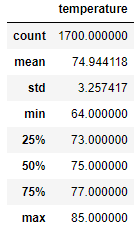
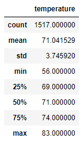

# surfs-up
Performing analysis on weather sample data

## Overview of Project

### Purpose
To analyze temperature data from Oahu, Hawaii to evaluate the feasibility of a ice cream parlor-surf shop for potential investment. 

## Results
June temperature data: &nbsp; &nbsp; &nbsp; &nbsp; &nbsp; 

December temperature data: 

- June is only slightly warmer than December on average 
    - 74 vs 71 degrees
- June and December have similar max temperatures
    - 85 vs 83
- June has a significantly higher minimum temperature than December
    - 64 vs 56

## Summary
The results show a warm, relatively consistent temperature in Oahu, Hawaii. This should be amenable to year round opperation of the potential ice cream parlor-surf shop. However, the wider fluctuations of temperature in December should be noted. Assuming there is a temperature that is too cold for ice cream and/or surfing, likely falling within the lower range of December's temperatures, a follow up query that counts the number of days under that temperature would be advisable.
Similar to counting the number of days with slow business due to low temperature, a followup query counting the number of days in June or December (or, potentially, each month, or season) with enough rain to disuade business would likely be more useful than average rainfall during a month or season. 
Additional weather data to consider for this evaluation could be cloud coverage, wind speeds, wave size, or humidity, however I lack sufficient knowledge about surfing and the local area to suggest how to structure a useful query for that data. 
